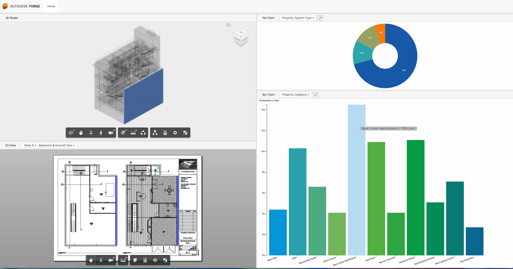

# Forge AEC Visual Reports

## Description

This example demonstrates the reporting capability of Autodesk Forge Viewer. Select the model from the Home page  to see the 2D and 3D representations of the model in the left pane. If the model has a 2D sheet, it will also be loaded along with a visual report showing the vital statistics of the model.

Additionally, you can view charts representing the quantity of the objects based on the selected attributes, such as types or materials. You can click on a wedge in the pie chart to highlight the corresponding objects in the model.

### Thumbnail

## Running the sample

Configuration is controlled by **NODE_ENV**
[environment variable](https://www.google.com/webhp?q=set+environment+variable&gws_rd=cr&ei=tum2WMaSF4SdsgHruLrIDg),
make sure to set it properly to **development** or **production**,
based on the configuration type you want to run.

In **development**, the client is dynamically built by the
[webpack-dev-middleware](https://github.com/webpack/webpack-dev-middleware), so just run:

 * `npm install`    *(downloads project dependencies locally)*

 * `npm start`      *(builds client on the fly and run server)*

 * open [http://localhost:3000](http://localhost:3000) in your favorite browser

In **production**, the client requires a build step, so run:

 * `npm install` *(not required if you already run at previous step)*

 * `npm run build-prod && npm start` *(builds client and run server)*

 * open [http://localhost:3000](http://localhost:3000) in your favorite browser

## License

That samples are licensed under the terms of the [MIT License](http://opensource.org/licenses/MIT).

## Written by

Jaime Rosales D. 
  
Forge Partner Development  
<a href="http://developer.autodesk.com/">Forge Developer Portal</a>  

